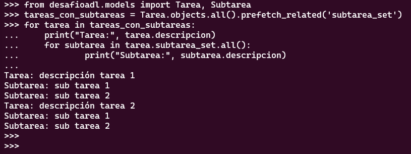

# Desafío - Django acceso a datos

## Descripción

Se solicita un proyecto de administración de tareas, donde tendremos Tareas y SubTareas.

Las tareas deben tener un identificador autonumérico, descripción y estado, las subtareas
tienen los mismos campos, más una relación a Tareas. El proyecto debe contar con un
archivos de servicios donde estará la lógica de aplicación sobre los modelos. Se podrá
presentar utilizando SQLite3 o Postgresql
Entonces, debemos tener lo siguientes requerimientos:

-Un proyecto llamado “desafio2” con una aplicación llamada “desafioadl”
-La conexión a base de datos se realiza con SQLite o Postgresql.
-En “desafioadl” deben existir dos modelos: Tarea y SubTarea.
-Los modelos deben tener campo id y descripción, la SubTarea debe tener una relación hacia Tarea.

El proyecto está en GitHub y es público. Puedes acceder al repositorio [aquí](https://github.com/ClaudioDL24/desafio2).

El proyecto utiliza las siguientes tecnologías:

- Django: Framework de desarrollo web en Python.
- Python: Lenguaje de programación utilizado para el desarrollo del proyecto.
- Base de Datos postgresql: Sistema de gestión de bases de datos relacional utilizado para almacenar los datos del proyecto.

## Autor

-Claudio Merino Fuentes.

## Instalación

Instrucciones.

## Uso

Instrucciones.

## Contribuir

Pasos para contribuir al proyecto.

## Licencia

Información sobre la licencia del proyecto.
